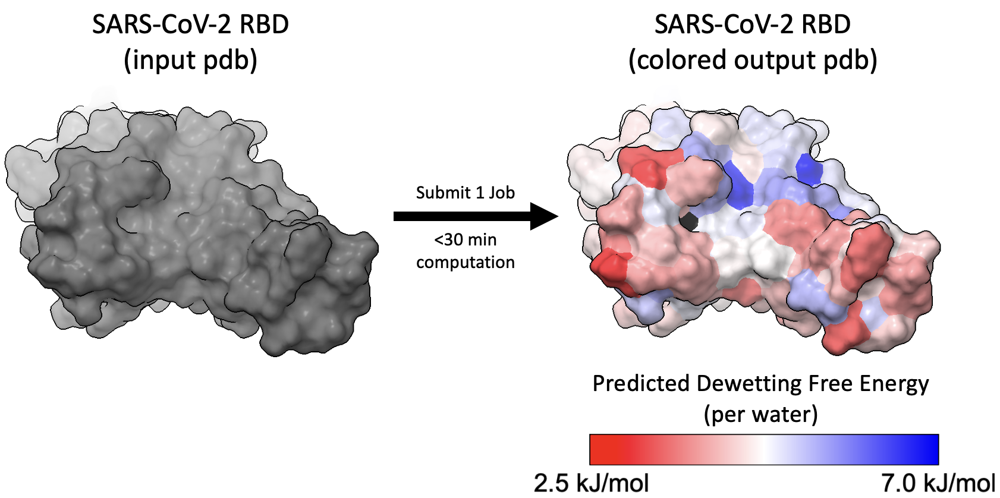

# protein_WaterStructure_Hydrophobicity

Use water structure analysis to color your protein based on predicted dewetting free energy (using Sam Lobo & Saeed Najafi's hydrophobicity model) and water triplet distribution principal component contributions (from Dennis Robinson and Sally Jiao's [work](https://pubs.acs.org/doi/10.1021/acs.jpcb.3c00826) modelling small hydrophobes).  



This analysis takes <20 min of computation for a 100 residue protein, including ~15 min on a GPU (NVIDIA RTX 3090 Ti) and ~2min on 24 CPU processors (Intel CoreTM i9-14900K with 1 thread per solvated residue / custom group). This time can be reduced depending on your confidence interval tolerance.  

---

### **Input:**
- pdb file of just protein (no water or ions)  

### **Output:**
- pdb file with dewetting free energy predictions of each residue (or custom group) listed in the tempfactor column
- 3 pdb files with the 3 principal component contributions of each residue (or custom group) listed in the tempfactor column
- csv file with triplet distribution for each residue (or custom group), histograms and plots of dewetting free energy predictions & principal componenet contributions, and many txt files of raw data triplet angles  

---

## Procedure summary:

1. Use GROMACS to ***build your system***: protein + water + ions
2. Use OpenMM to ***run a short MD simulation*** (GPU recommended)
3. ***Measure water angles*** around each residue/group (parallel CPUs recommended)
4. ***Process water angles***, and ***output pdbs*** with stored dewetting free energy predictions and principal component contributions
5. **Color pdbs** by dewetting free energy and principal component contributions

You can skip steps 1 & 2 if you already have a simulation to analyze.  

---

## Installation:

1. Create and activate a new conda environment:
```bash
conda create -n hydrophobicity python=3.9
conda activate hydrophobicity
```
2. Install required dependencies
```bash
conda install -c conda-forge openmm
conda install mdanalysis
```
You may need to install OpenMM with cuda support catered to your machine, e.g. `conda install -c conda-forge openmm cudatoolkit=11.2`  

3. GROMACS installation (used to preprocess files for OpenMM simulation)  
You simply need the `gmx` command accessible in your environment. 
For official installation instructions, refer to the [GROMACS installation guide](https://manual.gromacs.org/current/install-guide/index.html).
You may be able to install via conda:
```bash
conda install gromacs
```
4. Compile the water triplet analysis library
From the `water_triplets` subdirectory, run:
```bash
python setup.py build_ext --inplace
```
Test compilation after compiling with: `python test_waterlib_compilation.py`

5. Molecular Visualization 
We recommend installing [ChimeraX](https://www.cgl.ucsf.edu/chimerax/download.html) or [Pymol](https://pymol.org/) to visualize the dewetting free energy prediction or water structure of your protein.

---

## Main Code:  
- **process_with_gromacs.sh**
  - Usage: `bash process_with_gromacs.sh <protein[.pdb]>`
  - Outputs: topology file ('topol.top') and your solvated, neutralized system ('\<protein\>_processed.gro')
  - Uses basic GROMACS commands. Uses a99SB-disp force field with TIP4P-D water.
- **simulate_with_openmm.py**
  - Example usage:  
    `python simulate_with_openmm.py <protein[_processed.gro]>`   

    `python simulate_with_openmm.py myProtein_processed.gro --restrain` keep heavy atoms on protein restrained  

    `python simulate_with_openmm.py myProtein_processed.gro --restrain -ns 2`  running a 2 ns simulation (default is 5 ns)
  - Outputs: trajectory file ('traj.dcd') and log file with energies and more ('energies.log')
  - Runs a short MD simulation with a99SB-disp force field in NPT ensemble  
- water_triplets/**triplet.py**
  - Example usage:  
    `python triplet.py <protein[_processed.gro]> <trajectory> -res <int>` to analyze one residue  

    `python triplet.py myProtein_processed.gro traj.dcd -res 10 -ch B` to analyze residue 10 on chain B  

    `python triplet.py myProtein_processed.gro traj.dcd --groupsFile groups_file.txt --groupNum 20` to analyze the group described by MDAnalysis selection string in the 20th line of groups_file.txt  

    `python triplet.py myProtein_processed.gro traj.dcd --selection 'resname LYS and name NZ'` to analyze the atoms selected by a custom string (using MDAnalysis selection language)  

    `python triplet.py myProtein_processed.gro traj.dcd -res 10 --hydrationCutoff 6 --time 1` to define hydration waters as being 6 Angstroms (default is 4.25A) around resid 10's heavy atoms, and to analyze just the last 1 ns (default is 5 ns) of the trajectory   
  - Outputs: a txt file (in 'angles' subdirectory) of water triplet angles in the hydration shell of the group you selected where each frame of the trajectory is a new line.
- water_triplets/**run_triplets_parallel.py**
  - Usage: `python run_triplets_parallel.py <protein[.pdb]> --nprocs 8`
  - Parallelizes `python triple.py` calls across multiple CPU processors; defaults to one call per residue.
- water_triplets/**process_angles.py**
  - Example usage:  
    `python process_angles.py <protein[.pdb]>`  
    `python process_angles.py myProtein.pdb --multiChain` use when your protein has multiple chains  

    `python process_angles.py myProtein.pdb --groupsFile myCustomGroups.txt` use when you created several custom groups to analyze  

    `python process_angles.py myProtein.pdb --oneAnglesFile 'myProtein_resname_LYS_and_name_NZ_angles.txt'` to process just a single group's angles
  - Outputs: csv file ('{protein_name}_triplet_data.csv') with the group[s] triplet distributions
- water_triplets/**analyze_groups.py**
  - Usage: `python analyze_groups.py <protein[.pdb]>`
  - Outputs: 4 "colored" pdb files by property, histograms of the 4 properties, and 2D plots of each group's PCs (all in parent directory)
    - pdb files: {protein}_Fdewet_colored.pdb, {protein}_PC1_colored.pdb, {protein}_PC2_colored.pdb, {protein}_PC3_colored.pdb
    - histogram of 4 properties: {protein}_histograms.png
    - 2D PC plots: {protein}_PCs_2D.png
      

## Supporting Code:
- remove_checkpointed_duplicates.py
  - Called by simulate_with_openmm.py when a simulation is restarted from a checkpoint in order to clean up duplicate frames.
- water_triplets/water_properties.py
  - Called by triplet.py to measure water angles
- water_triplets/waterlib.f90
  - Called by water_properties.py to efficiently measure water angles
- water_triplets/convert_triplets.py
  - Called by analyze_groups.py to convert water triplet distributions to dewetting free energy predictions and principal component contributions.
- water_triplets/principalComps.csv
  - Read by convert_triplets.py 
- water_triplets/bulk_water_triplets.csv
  - Read by convert_triplets.py
    
---

## How to color the outputted pdbs

### With ChimeraX:
- open the outputted pdb and `show surfaces`
  - alternatively `hide cartoons`, `show atoms`, `style sphere` if you prefer spheres
- `color bfactor range 2.5,7 palette red-white-blue; color @@bfactor<-99 black`
  - 2.5 and 7 are the min and max values of the property (pick this based on the outputted histograms in Step 4)
  - colors all the "unsolvated" residues black (bfactor set to -100)
- Go to `Tools -> Depiction -> Color Key` to add a key, e.g. 2.5 kJ/mol; 7 kJ/mol.  
`2dlab text "<property_description>"` to make a label which you can drag by selecting "Move Label" in the Right Mouse tab.

### With Pymol:
- open the outputted pdb and `show surface` (or `show spheres`)
- `spectrum b, red_white_blue, minimum=2.5, maximum=7; color black, b<-99`

## Acknowledgements:
[Shell Lab](https://theshelllab.org) and [Shea Group](https://labs.chem.ucsb.edu/shea/joan-emma/);  
[UCSB CNSI](https://www.cnsi.ucsb.edu/) from computing resources;  
[Patel Group](https://patelgroup.seas.upenn.edu/) for [INDUS](https://github.com/patellab511/indus) technique used when fitting hydrophobicity model;  
[DE Shaw Group](https://www.deshaw.com/) for [a99SB-disp](https://github.com/paulrobustelli/Force-Fields/tree/master/Gromacs_FFs) force field
