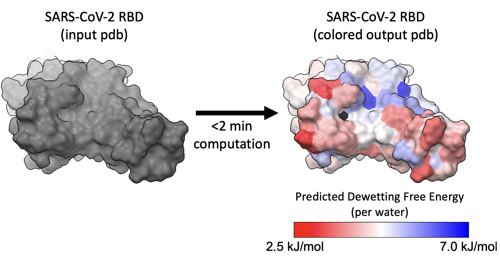

# HydroMap

Modeling water-protein interactions to map a protein's water structure, water-protein enthalpy, and dewetting free energy.  



This analysis takes <1.5 min of computation for a 100 residue protein, including ~45 seconds for a 500 ps MD simulation on a GPU (NVIDIA RTX 3090 Ti) and ~25 seconds to process each residue on 30 CPU processors (Intel CoreTM i9-14900K with 1 processor per solvated residue / custom group). 

---

### **Input:**
- pdb file of just protein (no water or ions)  

### **Output:**
- pdb file with dewetting free energy predictions of each residue (or custom group) listed in the tempfactor column
- pdb files with either predicted dewetting free energy, water structure features ([water triplet distribution principal components](https://pubs.acs.org/doi/10.1021/acs.jpcb.3c00826)), or water-protein potential energy for each residue (or custom group)
- csv files with water structure features, water-protein potential energy, and dewetting free energy features for each residue (or custom group) 

---

## Procedure summary

1. Use OpenMM to ***run a short MD simulation*** (GPU recommended)
2. Measure ***water angles*** and **water-protein potentials** for each residue/group (parallel CPUs recommended)
3. **Color pdbs** by predicted dewetting free energy, water structure features, and water-protein potential energy

You can skip steps 1 if you already have a simulation to analyze.  

---

## Installation:

1. Create and activate a new conda environment:
    ```bash
    conda create -n hydrophobicity python=3.9
    conda activate hydrophobicity
    ```
2. Install required dependencies:
    ```bash
    conda install -c conda-forge openmm mdanalysis
    ```
    You may need to install OpenMM with cuda support catered to your machine, e.g. `conda install -c conda-forge openmm cudatoolkit=11.2`  

3. GROMACS installation (used to preprocess files for OpenMM simulation):  
You simply need the `gmx` command accessible in your environment.  
For official installation instructions, refer to the [GROMACS installation guide](https://manual.gromacs.org/current/install-guide/index.html).  
You may be able to install via conda:
    ```bash
    conda install gromacs
    ```
4. Compile the water triplet analysis library:  
From the `water_triplets` subdirectory, run:
    ```bash
    python setup.py build_ext --inplace
    ```
    Test compilation after compiling with: `python test_waterlib_compilation.py`

5. Molecular Visualization setup:  
We recommend installing [ChimeraX](https://www.cgl.ucsf.edu/chimerax/download.html) or [Pymol](https://pymol.org/) to visualize the dewetting free energy prediction or water structure of your protein.

---

## Examples:
To do the full procedure (MD simulation, measure water angles/potentials, process and apply $F_{dewet}$ model), simply place your pdb (e.g. example_protein.pdb) in the main directory and do one of the following:
- `bash examples/procedure_singleChain_allRes.sh`
  - analyzes each residue in example_protein.pdb and outputs all properties (predicted $F_{dewet}$, PC1, PC2, PC3, water-residue enthalpy) to the results directory (csv & pdbs with property in bfactor column)
- `bash examples/procedure_multiChain_allRes.sh`
  - does the same analysis for a multi-chain protein (e.g. multiChain_protein.pdb), anayzing each residue on each chain separately
- `bash examples/procedure_customGroups.sh example_protein`
  - analyzes custom groups of your protein as defined in a text file (e.g.customGroups_example_protein.txt) and outputs their water triplet distribution principal component values (see PC definition [here](https://doi.org/10.1021/acs.jpcb.3c00826))

You can modify these scripts to change the input protein, the simulation length, the outputted properties, to toggle restraints, etc.

---

## How to color the outputted pdbs

### With ChimeraX:
- open the outputted pdb and `show surfaces`
  - alternatively `hide cartoons`, `show atoms`, `style sphere` if you prefer spheres
- `color bfactor range 7,3.5 palette lipophilicity; color @@bfactor<-998 black`
  - 3.5 and 7 are the min and max values of the property (pick this based on the outputted histograms in Step 4)
  - colors all the "unsolvated" residues black (bfactor set to -999)
- Go to `Tools -> Depiction -> Color Key` to add a key, e.g. 2.5 kJ/mol; 7 kJ/mol.  
`2dlab text "<property_description>"` to make a label which you can drag by selecting "Move Label" in the Right Mouse tab.

### With Pymol:
- open the outputted pdb and `show surface` (or `show spheres`)
- `spectrum b, red_white_blue, minimum=3.5, maximum=7; color black, b<-998`  

Here are min/max values and ChimeraX palettes we like for PC1, PC2, PC3, and residue-water potential (per water):
- PC1:  `color bfactor range -8,8 palette red-white-blue; color @@bfactor<-998 black`
- PC2:  `color bfactor range -2,8 palette cyanmaroon; color @@bfactor<-998 black`
- PC3:  `color bfactor range 2,-2 palette lipophilicity; color @@bfactor<-998 black`
- water_potential: `color bfactor range -50,-200 palette red-white-blue; color @@bfactor<-998 black`

---

## Main Code  
- **process_with_gromacs.sh**
  - Usage: `bash process_with_gromacs.sh myProtein.pdb`
  - Outputs: topology file ('topol.top') and your solvated, neutralized system ('myProtein_processed.pdb')
  - Uses basic GROMACS commands. Uses a99SB-disp force field with TIP4P-D water.
- **simulate_with_openmm.py**
  - Example usage:  
      - `python simulate_with_openmm.py <protein>_processed.pdb topol.top`   

      - `python simulate_with_openmm.py myProtein_processed.pdb --restrain` to keep heavy atoms on protein restrained  

      - `python simulate_with_openmm.py myProtein_processed.pdb --restrain -ns 10`  to run a 10 ns simulation (default is 5 ns)
  - Outputs: trajectory file ('traj.dcd') and log file with energies and other properties ('energies.log')
  - Runs a short MD simulation with a99SB-disp force field in NPT ensemble  
- water_triplets/**triplet.py**
  - Example usage:  
      - `python triplet.py <protein>_processed.pdb <trajectory> -res <int>` to analyze one residue  

      - `python triplet.py myProtein_processed.pdb traj.dcd -res 10 -ch B` to analyze residue 10 on chain B  

      - `python triplet.py myProtein_processed.pdb traj.dcd --groupsFile groups_file.txt --groupNum 20` to analyze the group described by MDAnalysis selection string in the 20th line of groups_file.txt  

      - `python triplet.py myProtein_processed.pdb traj.dcd --selection 'resname LYS and name NZ'` to analyze the atoms selected by a custom string (using MDAnalysis selection language)  

      - `python triplet.py myProtein_processed.pdb traj.dcd -res 10 --hydrationCutoff 6 --time 1` to define hydration waters as being 6 Angstroms (default is 4.25A) around resid 10's heavy atoms, and to analyze just the last 1 ns (default is 5 ns) of the trajectory   
  - Outputs: a txt file (in 'angles' subdirectory) of water triplet angles in the hydration shell of the group you selected where each frame of the trajectory is a new line.
- water_triplets/**run_triplets_parallel.py**
  - Usage: `python run_triplets_parallel.py myProtein.pdb traj.dcd --nprocs 8`
  - Parallelizes `python triplet.py` calls across multiple CPU processors; defaults to one call per residue.
- water_triplets/**process_angles.py**
  - Example usage:  
    - `python process_angles.py myProtein.pdb`  
    - `python process_angles.py myProtein.pdb --multiChain` use when your protein has multiple chains  

    - `python process_angles.py myProtein.pdb --groupsFile myCustomGroups.txt` use when you created several custom groups to analyze  

    - `python process_angles.py myProtein.pdb --oneAnglesFile 'myProtein_resname_LYS_and_name_NZ_angles.txt'` to process just a single group's angles
  - Outputs: csv file ('{protein_name}_triplet_data.csv') with the group[s] triplet distributions
- water_triplets/**analyze_groups.py**
  - Usage: `python analyze_groups.py myProtein.pdb`
  - Outputs: 4 "colored" pdb files by property, histograms of the 4 properties, and 2D plots of each group's PCs (all in parent directory)
    - pdb files: {protein}_Fdewet_colored.pdb, {protein}_PC1_colored.pdb, {protein}_PC2_colored.pdb, {protein}_PC3_colored.pdb
    - histogram of 4 properties: {protein}_histograms.png
    - 2D PC plots: {protein}_PCs_2D.png
- water_enthalpy/**potential.py**
  - Example Usage:
    - `python potential.py myProtein_processed.pdb traj.dcd --top topol.top -res 10 -t 5 --skip 50 --cutoff 0.55` to measure interactions between waters (within 0.55 nm) and residue 10 in the last 5ns of the trajectory, looking at every 50th frame. 
    - `python potential.py myProtein_processed.pdb traj.dcd --top topol.top -res 1 -ch B` to look at residue 1 in chain B. You can also use `--groupsFile` & `--groupNum`, or `--selection` to make an arbitrary selection with MDAnalysis selection strings. You can normalize by the number of hydration waters with the `--norm_per_water` flag.
  - Outputs: a csv file (in 'energies' subdirectory) with coulombic potential energy, LJ potential energy, and total potential energy between your group (e.g. residue 10) and waters within a cutoff (default 1nm).
- water_enthalpy/**run_potentials_parallel.py** and **run_potentials_serial.py**
  - Example Usage:
    - `python run_potentials_parallel.py myProtein.pdb traj.dcd --top topol.top --nprocs 8` to analyze all residues in the original pdb across 8 parallel processors; ideal if CPUs are available and cheap. Add `--multiChain` if you want to analyze each residue on each chain of your pdb file.
    - `python run_potentials_serial.py myProtein.pdb traj.dcd --top topol.top` to serially analyze all residues on a GPU; ideal if you don't have many CPU processors available
    - `python run_potentials_parallel.py myProtein.pdb traj.dcd --top topol.top --nprocs 8 --groupsFile groups_file.txt` to analyze each custom group in groups_file.txt (one per line) across 8 CPU processors
- **utils/process_and_predict.py**
  - Example Usage:
    - `python process_and_predict.py example_protein.pdb --anglesDir angles --potentialsDir potentials --model models/Fdewet.joblib --outdir results` to process angles/potentials and predict dewetting free energy with main model (for a99SBdisp)
    - `python process_and_predict.py example_protein.pdb --anglesDir angles --potentialsDir potentials --model models/Fdewet_isolated_aa_multi_forcefield.joblib --outdir results` to predict using alternative dewetting free energy model (trained on isolated amino acids for a99SBdisp, a03ws, and C36m)
- **utils/color_pdb_by_property.py**
  - Example Usage:
    - `python color_pbd_by_property.py example_protein.pdb results/example_protein_results.csv --outdir results` to output all one pdb per property (predicted Fdewet, protein-water potential per water, PC1, PC2, PC3) with property values in the bfactor column of the pdb.
    - `python color_pdb_by_property.py example_protein.pdb results/example_protein_results.csv --properties PC1 --minWaters 3` to color based on just PC1 and to not color groups that had fewer than 3 hydration waters on average within 4.25 angstroms of any group atom (bfactor will be marked as -100)

## Supporting Code
- remove_checkpointed_duplicates.py
  - Called by simulate_with_openmm.py when a simulation is restarted from a checkpoint in order to clean up duplicate frames.
- water_triplets/waterlib.c
  - Compiled by setup.py (see above) to build an executable that is called by triplet.py to efficiently measure water angles
- utils/get_PCs.py
  - Called by process_and_predict.py to convert water triplet distributions to dewetting free energy predictions and principal component contributions.
- data/principalComps.csv
  - Read by get_PCs.py 
- data/bulk_water_triplets.csv
  - Read by get_PCs.py
    
---
## Acknowledgements
[Shell Lab](https://theshelllab.org) and [Shea Group](https://labs.chem.ucsb.edu/shea/joan-emma/);  
[UCSB CNSI](https://www.cnsi.ucsb.edu/) from computing resources;  
[Patel Group](https://patelgroup.seas.upenn.edu/) for [INDUS](https://github.com/patellab511/indus) technique used when fitting hydrophobicity model;  
[DE Shaw Group](https://www.deshaw.com/) for [a99SB-disp](https://github.com/paulrobustelli/Force-Fields/tree/master/Gromacs_FFs) force field
